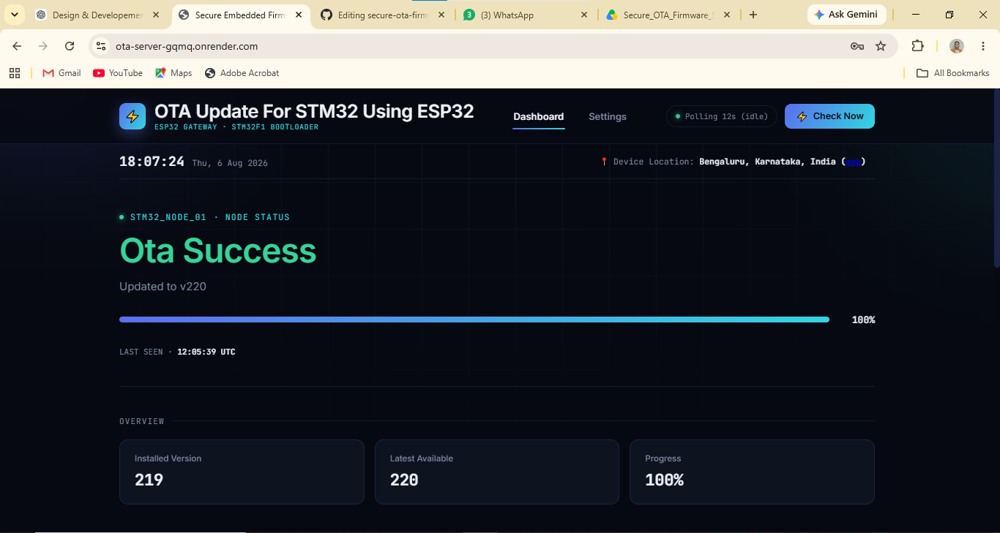
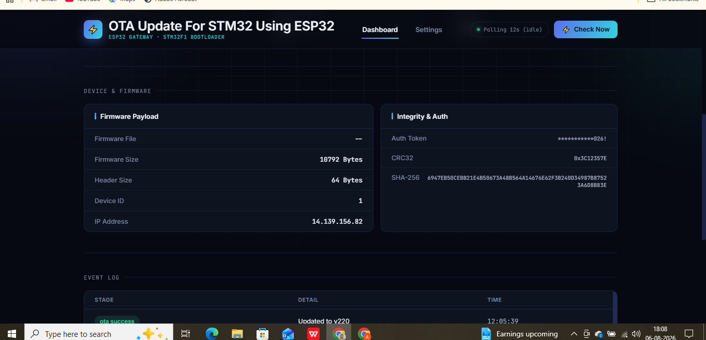
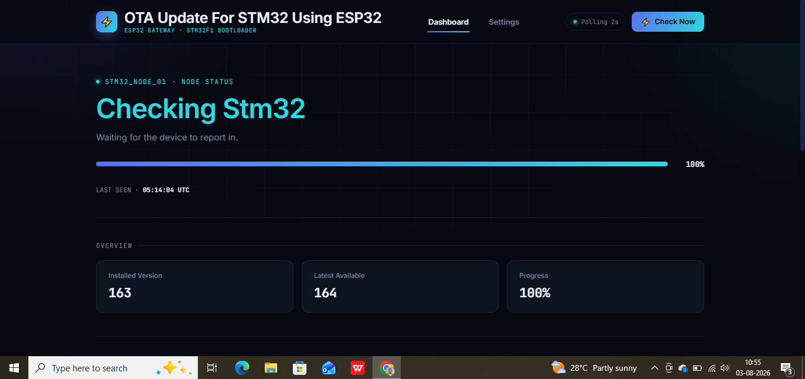
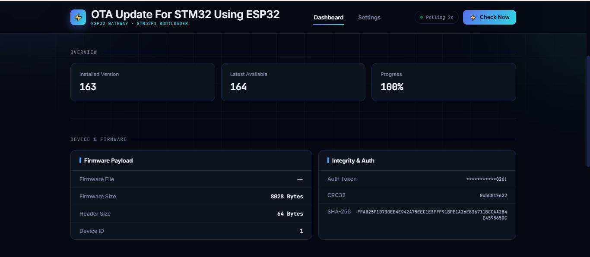
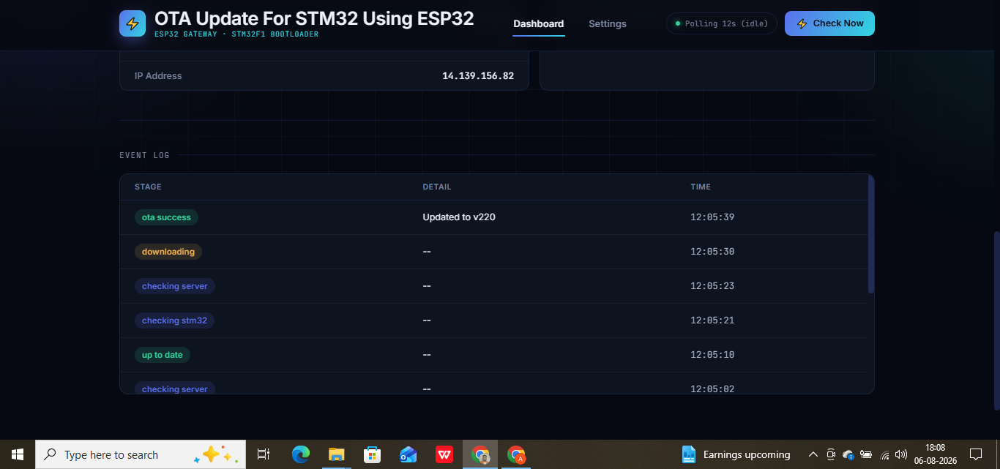
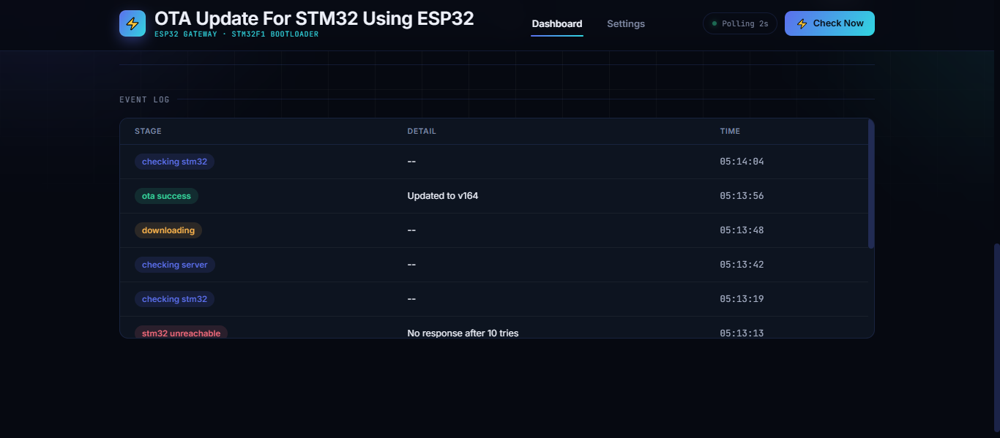

# Secure OTA Firmware Update Framework for STM32 Using ESP32

### Design and Development of a Secure Internet-Based OTA Firmware Update Framework for STM32 Embedded Systems


---

# Project Overview

This project presents a **Secure Embedded Firmware Management and Internet-Based Over-the-Air (OTA) Update Framework** for STM32 microcontrollers using an ESP32 Wi-Fi Gateway.

The framework enables firmware updates remotely over the Internet without requiring physical access to embedded devices or programming tools such as ST-Link after deployment.

The system integrates a **custom STM32 UART bootloader**, an **ESP32 Wi-Fi gateway**, a **Flask-based cloud server deployed on Render**, and a **real-time web dashboard** for monitoring OTA operations, firmware versions, update progress, security verification, and device status.

Unlike conventional OTA systems that operate only within a local network, this implementation supports firmware updates across **different Wi-Fi networks**, allowing firmware to be updated securely from anywhere with Internet connectivity.

---

# Motivation

Firmware updates are essential throughout the lifecycle of embedded systems.

Traditional firmware update methods require:

- USB Connection
- ST-Link Programmer
- Manual Installation
- Physical Access to the Device

These approaches become inefficient and costly when managing large-scale IoT deployments.

This project solves these limitations by implementing a secure cloud-based OTA firmware update system.

---

# Problem Statement

Embedded devices deployed in the field — inside enclosures, mounted in inaccessible locations, or distributed across many sites — are difficult and expensive to update using traditional wired methods. Every firmware revision, bug fix, or feature addition otherwise requires a technician to physically visit each device with a programmer.

This creates three concrete problems that the framework is designed to solve:

1. **Accessibility** — devices are not always physically reachable once deployed.
2. **Scalability** — updating tens or hundreds of devices one at a time by hand does not scale.
3. **Security** — any update mechanism that accepts firmware over a network must be able to verify that the firmware is authentic, complete, and untampered with before it is trusted and executed.

---

# Objectives

- Design a custom UART-based bootloader for STM32F103 capable of receiving, verifying, and flashing new application firmware.
- Build an ESP32-based Wi-Fi gateway that bridges an Internet-hosted firmware repository to the STM32 over a wired UART link.
- Implement a layered security model — device authentication, CRC32 integrity checking, and SHA-256 verification — before any received firmware is trusted.
- Provide a cloud-hosted firmware repository and REST API so firmware can be pushed from anywhere with Internet access, not just a local network.
- Build a real-time web dashboard for monitoring device status, firmware versions, and update progress.
- Validate the complete pipeline end-to-end on real hardware, not simulation.

---

# Key Features

## OTA Firmware Management

- Internet-Based OTA Updates
- Remote Firmware Updates
- Automatic Version Checking
- Manual Update Trigger
- OTA Progress Monitoring
- Cloud-Based Firmware Repository

## Bootloader

- Custom STM32 UART Bootloader
- Flash Memory Programming
- Memory Mapping
- Application Jump
- Firmware Header Parsing
- Recovery Support

## Security

- CRC32 Firmware Verification
- SHA-256 Integrity Verification
- Authentication Token Validation
- Firmware Version Validation

## Dashboard

- Real-Time OTA Status
- Device Information
- Firmware Information
- Event Logging
- Device Location
- Real-Time Date & Time
- Firmware Integrity Information
- OTA Progress Monitoring

## Cloud

- Flask REST API
- Render Cloud Deployment
- Remote Firmware Repository
- Internet-Based Communication

---

# Dashboard Overview

| Dashboard | Device & Firmware |
|-----------|-------------------|
|  |  |

### OTA Status

| OTA Success | Device Status |
|-------------|---------------|
|  |  |

### Monitoring & Logs

| Event Log | STM32 Monitoring |
|-----------|------------------|
|  |  |

---

# System Architecture

```text
                           Developer
                                │
                                │ Upload Firmware
                                ▼
                  Flask Server (Hosted on Render)
                                │
                                ▼
                    Firmware Repository
                                │
                       HTTP / HTTPS
                                │
                                ▼
                     ESP32 Wi-Fi Gateway
                                │
                     UART Communication
                                │
                                ▼
                  STM32 Secure Bootloader
                                │
                    Flash Programming
                                │
                CRC32 & SHA-256 Verification
                                │
                                ▼
                  STM32 Application Starts
                                │
                                ▼
                Dashboard Status Updated
```

---

# OTA Workflow

```text
Firmware Upload
        │
        ▼
Flask Server
        │
        ▼
Render Cloud
        │
        ▼
ESP32 Gateway
        │
        ▼
Version Check
        │
        ▼
Download Firmware
        │
        ▼
UART Transfer
        │
        ▼
STM32 Bootloader
        │
        ▼
Flash Programming
        │
        ▼
CRC32 Verification
        │
        ▼
Application Starts
        │
        ▼
Dashboard Updated
```

---

# Communication Protocol

The ESP32 and STM32 communicate over a single UART link at 115200 baud using a lightweight command/response protocol. The application and the bootloader both understand a subset of the same command set, so the ESP32 can talk to whichever one is currently running.

| Command | Byte | Handled By | Purpose |
|---|---|---|---|
| `CMD_GET_VERSION` | `0x04` | Application & Bootloader | Query the currently installed firmware version |
| `CMD_ENTER_BOOTLOADER` | `0x55` | Application | Request a reset into bootloader mode to begin an update |
| `CMD_UPDATE` | `0x55` | Bootloader | Begin an update sequence (header, erase, data transfer) |
| `CMD_DATA` | — | Bootloader | Transfer one firmware packet (length + payload + CRC16) |
| `CMD_END` | `0x45` | Bootloader | Finalize the update; triggers CRC32/SHA-256 verification |
| `CMD_EXIT` | `0x05` | Bootloader | Exit bootloader mode and jump to the application |

Each firmware data packet is framed as `[length_lo][length_hi][payload...][crc16_hi][crc16_lo]`, verified with a CRC16 checksum before being written to flash, and acknowledged with `ACK`/`NACK` so the ESP32 knows whether to advance or retransmit.

---

# Firmware Header Format

Before any firmware payload is transferred, the ESP32 sends a fixed-size header describing the update:

| Field | Description |
|---|---|
| Firmware Size | Total size of the firmware payload, in bytes |
| Firmware Version | Monotonically increasing version number |
| Device ID | Target device identifier, checked against the bootloader's configured ID |
| Auth Token | Shared secret string validated against the bootloader's stored token |
| CRC32 | Checksum of the complete firmware image |
| SHA-256 | Cryptographic hash of the complete firmware image |

The bootloader rejects the header outright — before any flash erase occurs — if the device ID or authentication token do not match, or if the offered firmware version is not strictly newer than the version currently installed.

---

# Update Sequence (Detailed)

1. **Trigger** — The ESP32 sends `CMD_ENTER_BOOTLOADER` to the running application.
2. **Reset** — The application records the update request in flash and performs a software reset.
3. **Bootloader Entry** — On boot, the bootloader detects the pending request and immediately begins the update sequence (no manual reset required).
4. **Header Exchange** — The bootloader receives and validates the firmware header (device ID, auth token, version).
5. **Erase** — The application flash region is erased page by page.
6. **Transfer** — Firmware is sent in fixed-size packets, each verified with CRC16 before being written and read back for verification.
7. **Finalize** — Once all bytes are received, the bootloader recomputes CRC32 and SHA-256 over the entire flashed image and compares them against the values from the header.
8. **Commit** — Only on a full match is the new firmware version recorded and the device reset into the new application. Any failure leaves the previous firmware untouched and bootable.

---

# Hardware Used

| Hardware | Purpose |
|-----------|----------|
| STM32F103C8T6 | Target MCU |
| ESP32 DevKit V1 | Wi-Fi Gateway |
| ST-Link V2 | Initial Programming |
| FT232 USB-UART | UART Communication |
| LEDs | Status Indicators |
| Push Buttons | Recovery Mode |
| Laptop/PC | Flask Server Development |

---

# Software Stack

## Embedded

- STM32CubeIDE
- Embedded C
- STM32 HAL
- UART Bootloader
- Flash Driver

## ESP32

- PlatformIO
- Arduino Framework
- Wi-Fi
- HTTP Client
- UART Communication

## Backend

- Python
- Flask
- REST API
- JSON

## Frontend

- HTML5
- CSS3
- JavaScript

## Cloud

- Render Cloud Platform

---

# Dashboard Features

The web dashboard provides real-time monitoring and management of the OTA process.

- Device Status
- Firmware Version
- Available Firmware
- OTA Progress
- Firmware Information
- Device Location
- Current Date & Time
- Authentication Token
- CRC32 Verification
- SHA-256 Verification
- Event Logs

---

# Security Features

The OTA framework implements multiple verification mechanisms to ensure firmware authenticity and integrity.

- CRC32 Verification
- SHA-256 Integrity Verification
- Authentication Token Validation
- Firmware Version Validation
- Header Verification

Each layer serves a distinct purpose:

- **CRC16**, checked per-packet, catches transmission errors on the UART link immediately, so a corrupted packet is retried before it is ever written to flash.
- **CRC32**, checked once over the entire image after transfer, confirms the image was assembled correctly in flash from start to finish.
- **SHA-256** provides a cryptographic-strength integrity check independent of CRC32, guarding against the (astronomically unlikely but non-zero) case of a CRC32 collision.
- **Authentication Token** and **Device ID** validation ensure the bootloader only accepts firmware intended for this specific device from a trusted source, rejecting the header outright before any flash operation begins.
- **Firmware Version Validation** prevents downgrade attacks and accidental reflashing of older, potentially vulnerable firmware.

---

# Remote OTA Capability

One of the key highlights of this project is its ability to perform firmware updates over the Internet.

Unlike traditional implementations that require the server and device to be connected to the same local network, this framework allows firmware updates across different Wi-Fi networks.

As long as the ESP32 has Internet connectivity, firmware can be securely downloaded from the Render-hosted Flask server.

---

# Event Logging

The dashboard maintains real-time event logs during every OTA operation.

Typical events include:

- Checking Server
- Checking STM32
- Firmware Available
- Download Started
- Download Completed
- Flash Programming
- CRC Verification
- OTA Success
- OTA Failed

---

# Recovery and Fault Tolerance

The bootloader is designed so that a failed or interrupted update never leaves the device unbootable:

- If the update flag is set but the header, authentication, or version check fails, the bootloader jumps straight back to the last known-good application rather than leaving the device stuck.
- The pending-update flag is cleared only after a full CRC32 and SHA-256 match on the newly written image — never earlier — so a power loss or connection drop mid-transfer simply causes the bootloader to retry on the next boot instead of committing a partial image.
- An idle timeout in the bootloader's command loop ensures that if the ESP32 never responds (Wi-Fi down, server unreachable, gateway crash), the device automatically falls back to running its existing application rather than waiting indefinitely.

---

# Testing and Validation

The complete pipeline was validated end-to-end on physical hardware rather than in simulation:

- **Unit-level** — individual bootloader commands (`CMD_GET_VERSION`, `CMD_UPDATE`, `CMD_DATA`, `CMD_END`, `CMD_EXIT`) were exercised and verified against expected UART responses.
- **Integration-level** — full update cycles were run from a cold application boot, over a Wi-Fi network distinct from the development machine, downloading from the live Render-hosted server.
- **Fault-injection** — updates were deliberately interrupted (power loss, Wi-Fi drop, corrupted packets) to confirm the device always recovers to a bootable state.
- **Repeatability** — multiple consecutive OTA cycles were run back-to-back to confirm version increments, flag handling, and reset timing remain reliable across repeated use, not just a single successful run.

---

# Applications

- Industrial IoT sensor nodes deployed in hard-to-reach locations
- Smart agriculture and environmental monitoring devices
- Home automation and smart appliance controllers
- Remote asset tracking and telemetry devices
- Any battery-powered or enclosure-mounted embedded product where physical reprogramming is impractical after deployment

---

# Comparison with Traditional Update Methods

| Aspect | Wired (ST-Link/USB) Update | This Framework |
|---|---|---|
| Physical Access Required | Yes | No |
| Works Across Different Networks | N/A | Yes |
| Scales to Many Devices | Poor | Good |
| Update Verification | Manual | Automated (CRC32 + SHA-256) |
| Rollback on Failure | Manual | Automatic |
| Remote Monitoring | None | Real-Time Dashboard |

---

# Technologies Used

- STM32
- ESP32
- Embedded C
- Python
- Flask
- HTML
- CSS
- JavaScript
- UART
- HTTP
- JSON
- PlatformIO
- STM32CubeIDE
- Render
- Git
- GitHub

---

# Results

The proposed framework successfully demonstrates:

- Secure Internet-Based OTA Updates
- Remote Firmware Updates Across Different Wi-Fi Networks
- Automatic Firmware Version Management
- Reliable UART Firmware Transfer
- Flash Programming using Custom Bootloader
- CRC32 and SHA-256 Firmware Verification
- Real-Time Dashboard Monitoring
- Cloud-Based Firmware Repository
- Successful Firmware Deployment Without Physical Access

---

# Future Enhancements

- Digital Signature Verification
- Raspberry Pi Edge Server
- Secure Device Provisioning
- Certificate-Based Authentication
- Cloud Database Integration
- Mobile Application
- Batch Device Update Scheduling
- OTA Analytics Dashboard

---

# Installation

## Clone Repository

```bash
git clone https://github.com/your-username/secure-ota-firmware-update-stm32-esp32.git
```

## STM32

- Import Bootloader Project
- Build
- Flash using ST-Link

## ESP32

- Open PlatformIO
- Configure Wi-Fi Credentials
- Build
- Upload Firmware

## Flask Server

```bash
cd Flask_Server
pip install -r requirements.txt
python app.py
```

Or deploy using **Render**.

---

# Project Structure

```text
Secure_OTA_Firmware_System
│
├── STM32_Bootloader
├── STM32_Application
├── ESP32_Gateway
├── Flask_Server
├── Dashboard
├── Firmware
├── Documentation
├── Images
├── README.md
└── LICENSE
```

---

# Publication

This project was presented as a poster at **INCIP-2026**, hosted by the Department of Electronics and Communication Engineering, Central University of Karnataka (August 20–21, 2026), under the guidance of **Veeresh G. Kasabegoudar**.

---

# Acknowledgments

Sincere thanks to **Veeresh G. Kasabegoudar**, Department of Electronics and Communication Engineering, Central University of Karnataka, for guidance and support throughout the design, development, and validation of this project.

---

# Author

**Ankush Saroj**

B.Tech – Electronics and Communication Engineering

Embedded Systems | IoT | Firmware Development

GitHub: https://github.com/your-username

LinkedIn: https://linkedin.com/in/your-profile

---

# License

This project is licensed under the MIT License.

See the LICENSE file for more details.
